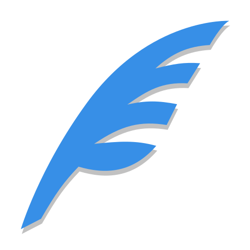

# Scriba

**A simple editor, previewer and exporter for AsciiDoc and MarkDown**

## Features description

The editor consists of 3 main areas. That being the writing area on the left, preview area on the right and the control panel at the bottom. The visibility of the writing area and the preview area can be changed with the button in the center of the control panel. Controls that are relevant to the writing area are positioned under the writing area and controls that are relevant to the preview area are positioned under the preview area. The changes you make in the writing area are continously saved to the browser storage and will persist across sessions. You can export your work to PDF or AsciiDoc source file. When exporting to PDF the app will open you browser's print dialog where an option "save to PDF" or "print to PDF" should be available.

## Development

I use [Bun](https://bun.com/) for package management. But realistically the current setup should work with [NodeJS](https://nodejs.org/en) too.

As a code editor I kindly recommend [Zed](https://zed.dev/).

- Use `bun run dev` to start a development server that will "hot reload" modules as you make changes in them.

- Use `bun run build` to build the app into files that can be distributed (hosted on a server).

- Use `bun run preview` to start a preview server which hosts the files for distribution you build with the `bun run build` command.

## Hosting

Run `docker compose up -d --build` to run a nginx server on port 3002.

## Hodnocení

| Kategorie                         | Splněno | Komentář                                                                                                                                                                                         | body |
| --------------------------------- | ------- | ------------------------------------------------------------------------------------------------------------------------------------------------------------------------------------------------ | ---- |
| Dokumentace                       | ✅      |                                                                                                                                                                                                  | 1    |
| Validita                          | ✅      |                                                                                                                                                                                                  | 1    |
| Semantické značky                 | ✅      | Snažil sem se. Např i všechna tlačítka mají title kvůli přístupnosti                                                                                                                             | 1    |
| Grafika - SVG / Canvas            | ✅      | SVG logo používám na [splashscreenu](index.html#L55) a po stránce používám [ikonky](./src/components/Icon.tsx) z [SVG spritu](./src/assets/icons.svg).                                           | 2    |
| Média - Audio/Video               | ⛔      |                                                                                                                                                                                                  | 1    |
| Formulářové prvky                 | ☑️      | Nevím jestli se to dá počítat, ale ve [WritingArea](./src/components/WritingArea.tsx) se nějaké rádoby formulářové věci dějí.                                                                    | 2    |
| Pokročilé selektory               | ✅      | Např. [zde](./src/components/WritingArea.tsx#L108)                                                                                                                                               | 1    |
| CSS3 transformace 2D/3D           | ✅      | Např. [zde](./src/index.css#L66)                                                                                                                                                                 | 2    |
| CSS3 transitions/animations       | ✅      | [Stejný příklad](./src/index.css#L66)                                                                                                                                                            | 2    |
| Media queries                     | ✅      | Např. [zde](./src/index.css#L9). Přizpůsobení se mobilům lze vidět [zde](./src/App.tsx#L64).                                                                                                     | 2    |
| Nested CSS                        | ✅      | Např. [zde](./src/components/WritingArea.tsx#L108)                                                                                                                                               | 1    |
| OOP přístup                       | ✅      | Např třída [Processor](./src/modules/processor.ts) a její rozšiřující třídy [AsciiDocProcessor](./src/modules/processor/asciidoc.ts) a [MarkDownProcessor](./src/modules/processor/markdown.ts). | 2    |
| Použití JS frameworku či knihovny | ✅      | Použil jsem knihovnu React.                                                                                                                                                                      | 1    |
| Použití pokročilých JS API        | ✅      | [Zde](./src/modules/export_adoc.ts) je práce s File API.                                                                                                                                         | 3    |
| Funkční historie                  | ⛔      |                                                                                                                                                                                                  | 2    |
| Ovládání medií                    | ⛔      |                                                                                                                                                                                                  | 1    |
| Offline aplikace                  | ✅      | Aplikaci lze nainstalovat jako PWA v prohlížečích, které to podporují                                                                                                                            | 2    |
| JS práce s SVG                    | ⛔      |                                                                                                                                                                                                  | 2    |
| Webová komponenta                 | ⛔      |                                                                                                                                                                                                  | 2    |
